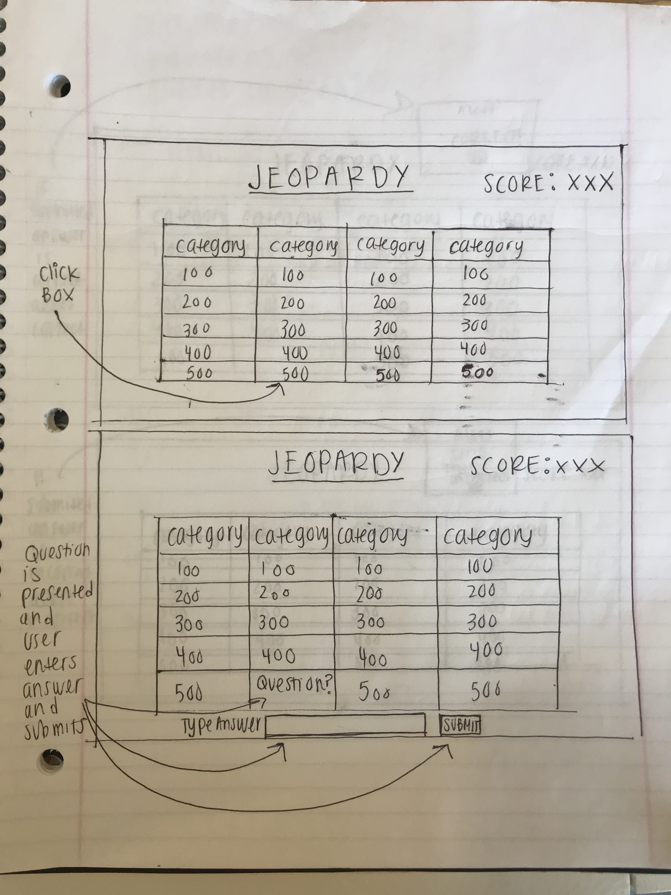
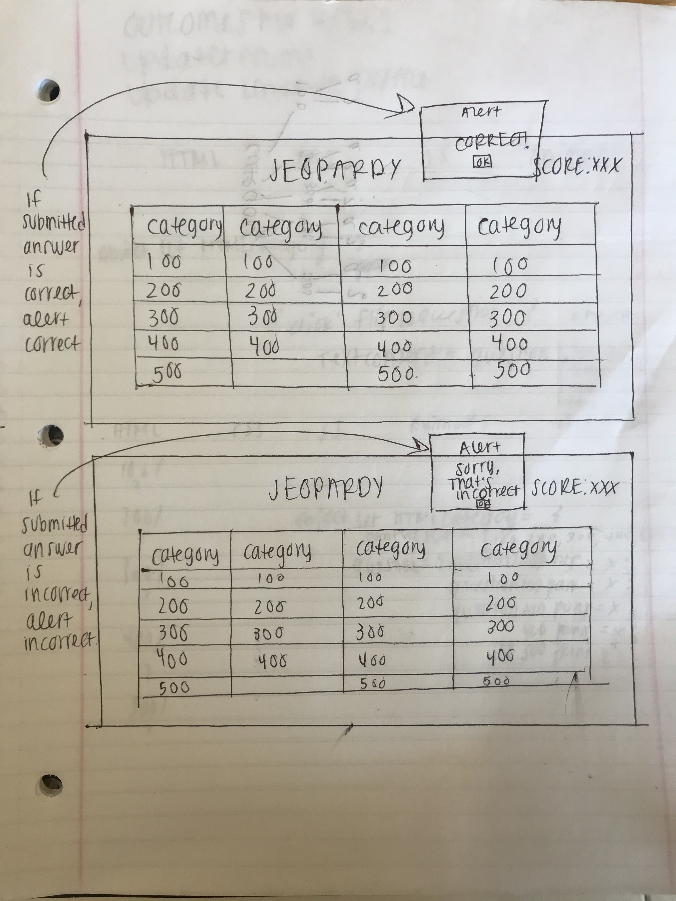

# project1-jeopardy

[GitHub](https://github.com/racheltezza/project1-jeopardy "My gitHub repo")

[Project](suspicious-meitner-d98d30.netlify.com "My deployed site")

[Trello](https://trello.com/b/v0zdkZFO/sei22-project-1 "My Trello board")

# H1 WIREFRAMES

#INSTRUCTIONS:
Choose a question to answer by clicking on one of the dollar values in a category. Type answer into input box and click submit button to check if answer is right. Objective of the game is to win jeopardy by earning $2000.

#LANGUAGES: 
HTML, CSS, JavaScript